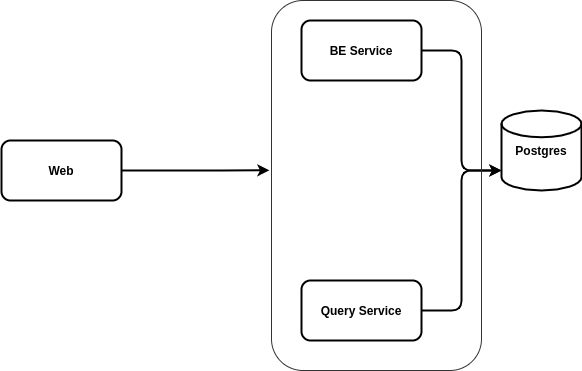

# Ecommerce Platform

## Overview
This is an ecommerce platform for small businesses, which provides features such as payment processing through different platforms, product creation, stock and order management, expense and income analysis.

## High Level Architecture

The backend service act not only as a CMS (Content Management System) but as the main service to process payments, sales, expenses, settings and users. It also manages the user permissions to access resources and perform different operations.

All data is stored in PostgresDB.

The query service is in charge of processing requests to obtain different metrics that the frontend consumes to display it in charts.

The web frontend interacts with both the backend and query services.

## Stack

### Web
- Nextjs
- TailwindCSS
- Typescript
- Apollo Client

### Backend
- Strapi CMS
- GraphQL support
- Google OAuth integration

### Query Service
- Cube.js